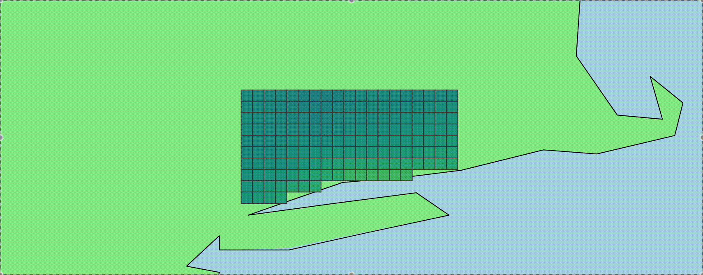
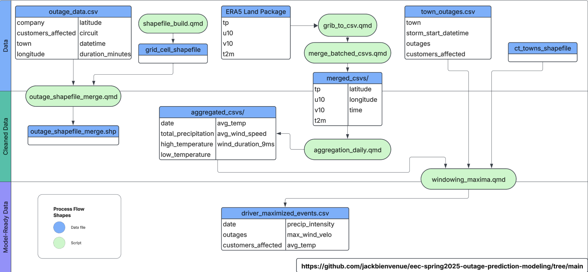
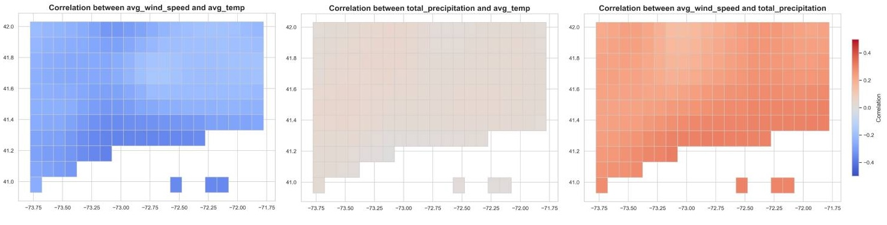
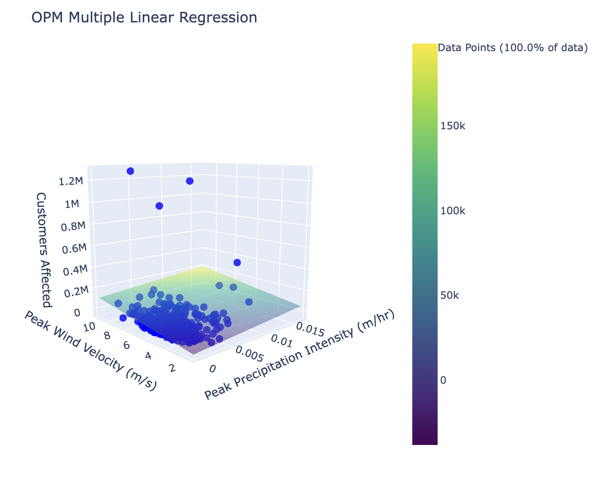

# UConn EEC - STAT4190 - Internship Spring 2025
[UConn Eversource Energy Center](https://www.eversource.uconn.edu/) - [Jack Bienvenue](https://www.linkedin.com/in/jackbienvenue/) - Spring 2025 internship towards completion of B.S. in Statistical Data Science, [UConn Department of Statistics](https://statistics.uconn.edu/).

  

This repository contains scripts which allow for the construction of an outage prediction model for the state of Connecticut using meteorological data from the [European Center for Medium-range Weather Forecasting (ECMWF) ERA5 LAND package dataset.](https://www.ecmwf.int/en/era5-land)

## PROBLEM DESCRIPTION:

Power outages endanger lives, disrupt important services, and are destructive to productivity. Outage prediction models help energy providers make better decisions surrounding preparation and optimizing grid resiliency infrastructure upgrades. 

Existing outage prediction models can include *drivers* (covariates/ input variables) whose data cannot be found ubiquitously across geographic regions. The selected drivers for this outage prediction models will be taken from the ECMWF's weather dataset for all of the Earth's surface. 

This project proposes a method for outage prediction modeling which uses open data to lay the groundwork for potentially geographically generalizable lightweight prediction modeling using Connecticut as a case study.

## DATA DESCRIPTION:

This repository provides scripts to ease the process of data cleaning. This open meterological data can be sourced through the [ECMWF ERA5 LAND package dataset.](https://www.ecmwf.int/en/era5-land)

The data provided by ECMWF is highly detailed, and provides weather data at high temporal resolution (hourly), and moderate gridded spatial resolution (~9x13km).

The variables of interest beyond index data (time, latitude, longitude) to be extracted from the ERA5 LAND files are:

- *tp*, the total precipitation in an hour (*m*)
- *u10*, the East (+)/ West (-) wind vector (recorded at 10m height, *m/s*)
- *v10*, the North (+)/ South (-) wind vector (recorded at 10m height, *m/s*)
- *t2m*, the temperature (recorded at 2m height, *K*)

## DEPENDENCIES:

The scripts in this repository are written using **Quarto**, an free software which allows for markdown-code cell development and various forms of outputs, like notebooks and presentations. Quarto can be downloaded [here](https://quarto.org/docs/get-started/) and runs on top of Jupyter for Python, the language of this project. 

All package dependencies are listed in the requirements.txt file. Some of these include:

- pandas
- geopandas
- numpy
- folium
- xarray
- cfgrib

-----

-----

# Data Cleaning & Processing:

  

Since the data processing for analysis is comprised of many stages, let's walk through these.

**The GRIB files provided from ECMWF are time series of weather data for whole geographic areas, which are comprised on rectangular (spherically projected because of the surface of the Earth) grid cells. We want to:**
**1. Make data accessible to us by converting to CSV, and**
**2. Gather time series for individual grid cells.**

First, download data from the ERA5 Land Package. Next, perform data handling for GRIB files from the European Center for Medium-Range Weather Forecasting (ECMWF) to CSVs:

1. Process GRIB files from **data/data_CT** using **scripts/grib_to_csv.qmd** (NOTES: This operation may have to be batched if you experience processing constraints; it is important to set *hourly=TRUE* in the function *grib_folder_processing* for aggregation later on. Read more in *scripts/grib_to_csv.qmd*.)
2. IF THE PREVIOUS STEP WAS COMPUTED IN BATCHES, merge batches using **scripts/merging_batched_csvs.qmd**. Otherwise, proceed.
3. Convert hourly dataframes to daily using aggregation by using **scripts/aggregation_daily.qmd**

Next, construction of grid cells for geospatial reference, visualization, & analysis:

1. Use scripts/shapefile_build.qmd to construct grid cells or access the default ones in data/grid_cell_shapefile

-----

-----

# Evaluation of Stationary Assumption for Drivers:

  

Commonly, papers in the field of outage prediction modeling use an assumption of stationarity for the covariances of pairs of drivers in the model. This repository provides scripts to allow you to visualize the stationarity of pairs of predictors for your model. 

In the figure above, you can see the correlation (standardized from covaraince for visualization purposes) for some covariates in the model. While there are circumstances where gradients form in the covariance of drivers, it appears that sign of effects are consistent over the areas and that the variation is reasonably low for the assumption.

### How to Evaluate Stationarity Assumptions for your ROI:

1. Ensure that the grid cell shapefile for your ROI has been constructed as illustrated in the *Data Cleaning & Processing* section above.
2. Ensure that a directory exists containing the aggregated daily data for your ROI as illustrated in the *Data Cleaning & Processing* section above.
3. Use *visualization/spatial_correlation_mapping.qmd* to create figures to view

Note that the scale of correlation between drivers defaults to a range of -0.5 to 0.5 for best visual inspection in the case studied. Since correlation ranges from -1 to 1, you may have to change the range to accomodate for visualizations including stronger correlations. 

Visually inspect the outputs, and observe whether the values tend to be approximately stationary, or if there is reason for concern for a stationarity assumption. Reasons for concern include ranges of correlations which are on both sides of 0, very large variations in the correlations, or relatively strong apparent clustering or dispersion. 

---

---

# Modeling Outages

## Collecting necessary data

Data:
- CSV of outage events with columns:
  - customers_affected (count data)
  - longitude
  - latitude
  - datetime
  - duration_minutes
- Shapefile of grid cells

Begin by merging the outage data with the shapefiles using scripts/outage_shapefile_merge.qmd.

Continue onto scripts/windowing_maxima.qmd to find peak precipitation intensity and wind velocity in a 48 hour window surrounding the storm start time.

Model using modeling/modeling.qmd.

---

---

Best of luck and happy modeling!

  

